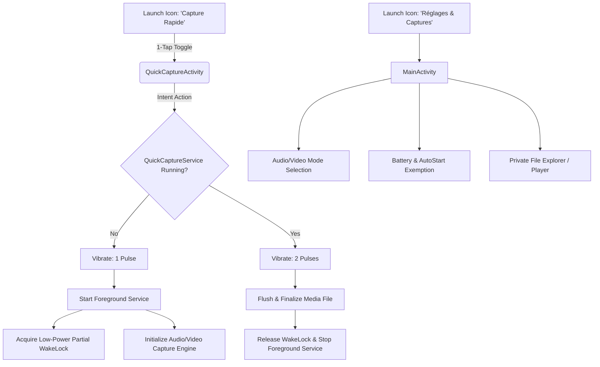

# 👻 GhostRec — Android Stealth Capture & Personal Safety Engine

[](https://developer.android.com)
[](https://kotlinlang.org)
[](https://gradle.org)
[](#privacy--security)
[-red.svg)](LICENSE)

> **GhostRec** is an ultra-discreet, one-tap instant background audio & video recording engine for Android.  
> Designed as an emergency personal safety tool with low-power DSP sampling, headless toggle, silent camouflaged service lifecycle, and isolated local storage.

---

## ⚖️ Legal Disclaimer & Ethical Notice / Avertissement Légal

> [!WARNING]
> ### 🛡️ Usage strictly dedicated to Self-Protection & Personal Safety
> **GhostRec is engineered exclusively for legitimate personal safety, emergency situations, self-defense, proof gathering in cases of harassment/threats, and authorized educational/research purposes.**
>
> ❌ **MISUSE STRICTLY FORBIDDEN:** This software MUST NEVER be used for malicious surveillance, spying, voyeurism, unlawful harassment, invasion of privacy, or any harmful acts.
>
> ⚠️ **TOTAL DISCLAIMER OF LIABILITY:**  
> The developer formally **declines and disclaims all responsibility and legal liability** for any diverted, abusive, unauthorized, or illegal use of this software by third parties. Every user is solely responsible for ensuring that their use complies with all applicable local, national, and international laws regarding audio/video recording and privacy consent.

---

## ⚡ Highlights & Features

- 👆 **1-Tap Instant Toggle**: An invisible launcher activity that starts or stops recording in less than 50 milliseconds with discreet haptic vibration feedback (1 pulse = start, 2 pulses = stop).
- 🎙️ **Low-Power DSP Audio Engine**: Uses optimized AAC / AMR-WB encoding at 22.05 kHz / 64 kbps mono, reducing CPU load by up to **85%** compared to standard high-res recorders.
- 🎬 **Stealth CameraX Video Engine**: Background video capture using Android CameraX with zero on-screen preview, functioning seamlessly even with the screen locked/turned off.
- 🔋 **Zero Battery Drain When Idle**: Unlike continuous listeners, GhostRec spawns **no persistent background services** or notifications when not actively recording.
- 🔒 **100% Private & Offline**: Zero network permissions declared in `AndroidManifest.xml`. Captured media is stored strictly in isolated app-specific internal storage (`getExternalFilesDir`).
- 📁 **Built-in Capture Manager**: An AMOLED dark-mode management interface to review, play back, and delete saved captures.
- 📱 **MIUI & Android 11+ Ready**: Native wake-lock management and battery exemption support for aggressive OEM background killers (Xiaomi, Huawei, Oppo, Vivo, Samsung).

---

## 🏗️ Architecture Overview



---

## 📦 Project Structure

```text
GhostRec/
├── app/
│   ├── src/main/
│   │   ├── java/com/example/quickcapture/
│   │   │   ├── capture/
│   │   │   │   ├── AudioRecorderManager.kt   # Low-power AAC/DSP audio pipeline
│   │   │   │   └── VideoRecorderManager.kt   # Background CameraX video engine
│   │   │   ├── service/
│   │   │   │   └── QuickCaptureService.kt    # Foreground service lifecycle
│   │   │   ├── ui/                           # ViewBinding & Dark AMOLED UI
│   │   │   ├── utils/
│   │   │   │   ├── HapticHelper.kt           # Discrete tactile vibration patterns
│   │   │   │   ├── PreferencesHelper.kt      # SharedPreferences manager
│   │   │   │   └── StorageHelper.kt          # Isolated app file manager
│   │   │   ├── MainActivity.kt               # Settings & Media Management
│   │   │   └── QuickCaptureActivity.kt       # 1-Tap headless toggle launcher
│   │   ├── res/                              # Layouts, themes & drawables
│   │   └── AndroidManifest.xml               # Clean offline manifest (Zero Internet)
├── DOCS/
│   └── android_call_recording_deepdive.md    # Reverse-engineering study on MediaTek/MIUI Audio HAL
├── release/
│   └── GhostRec-debug.apk                    # Ready-to-install standalone APK
├── build.gradle.kts                          # Root build script
├── gradle.properties                         # JBR JDK 17 & JVM configuration
├── LICENSE                                   # Non-Commercial License
└── README.md
```

---

## 🚀 Quickstart & Installation

### Option 1: Direct Install via ADB (Recommended)

Connect your Android phone with USB Debugging enabled:

```bash
# Clone the repository
git clone https://github.com/your-username/GhostRec.git
cd GhostRec

# Install pre-built APK directly
adb install -r release/GhostRec-debug.apk
```

### Option 2: Build from Source with Gradle

Prerequisites: **JDK 17** & **Android SDK Platform 34**.

```bash
# Build the Debug APK
./gradlew assembleDebug

# Install to connected device
./gradlew installDebug
```

---

## 🛡️ Privacy & Security Design

| Aspect | Guarantee |
| :--- | :--- |
| **Network Access** | **Zero**. No `android.permission.INTERNET` requested. The app physically cannot send data over the network. |
| **Media Storage** | Files are stored in sandboxed app-specific directories (`Android/data/com.example.quickcapture/files/private_captures`). |
| **Lifecycle Safety** | WakeLocks are automatically released upon capture completion to prevent battery drainage. |
| **Telemetry / Ads** | None. Pure native Kotlin with zero third-party tracking SDKs. |

---

## 🔬 Technical Deep-Dive: Android Audio & Call Recording Restrictions

As part of this project's research, an in-depth reverse-engineering study was conducted on Android telephony audio capture paths, MediaTek MT6785 HAL (`audio.primary.mt6785.so`), AudioFlinger, and SELinux policies on Android 10/11.

Read the full engineering whitepaper:  
👉 **[DOCS/android_call_recording_deepdive.md](DOCS/android_call_recording_deepdive.md)**

---

## 📄 License & Commercial Restrictions

This project is licensed under a **Custom Non-Commercial / Source-Available License** — see the [LICENSE](LICENSE) file for full details.

- ✅ **Free for personal, academic, educational, and research use.**
- ❌ **Commercial use, monetization, or redistribution in commercial products is strictly prohibited without prior written authorization.**
- ✉️ For commercial inquiries or custom licensing: **hamlat.louai@gmail.com**
